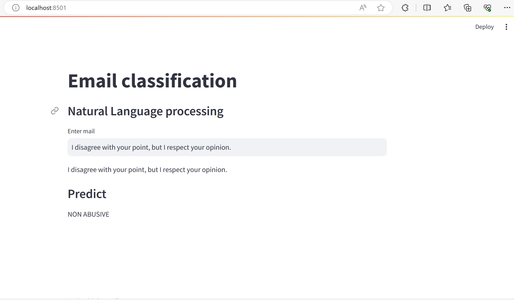

## NLP Email Classifier

Inappropriate emails would demotivates and spoil the positive environment that would lead to
more attrition rate and low productivity and Inappropriate emails could be on form of bullying,
racism, sexual favoritism and hate in the gender or culture, in today’s world so dominated by
email no organization is immune to these hate emails.
-The goal of the project is to identify such emails in the given day based on the above
inappropriate content.

## Data Set Details:
-The dataset contains around 20 lakh emails generated by employees of an
organization.


## Model used to predict probabilities

* Gaussian NavieBayes
* Multinomial NavieBayes
* Bernoulli NavieBayes

## Model Deployment

### Install dependencies

```sh
$ pip install -r requirements.txt
```

### Run Stremlit
```sh
$ streamlit run streamlit_nlp.py
```

Access it using `http://localhost:8501/`

### Outcome





